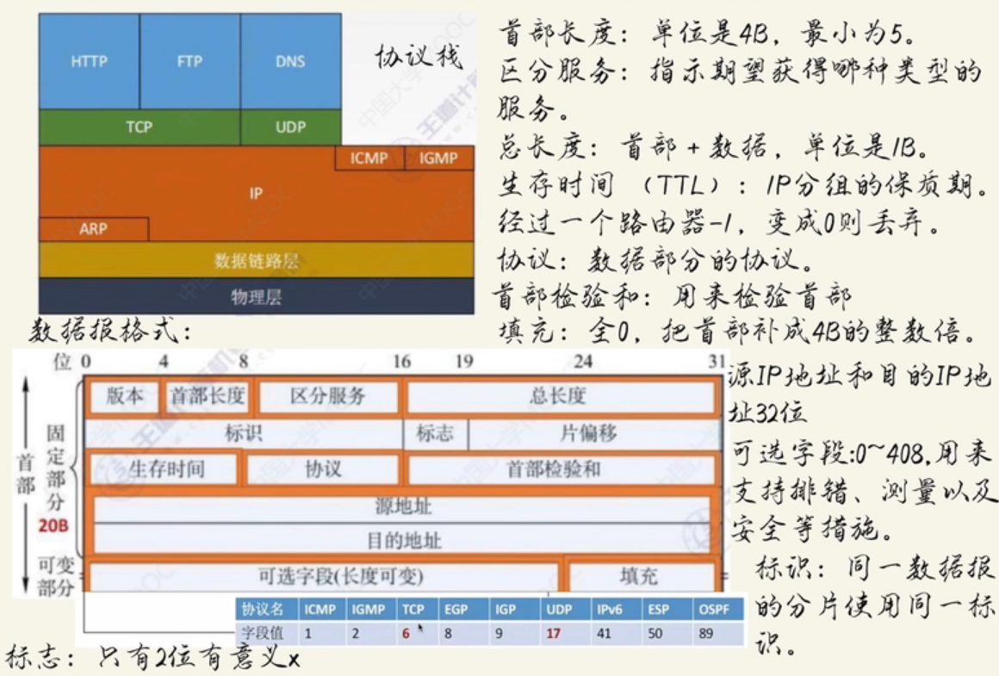

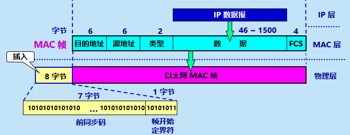

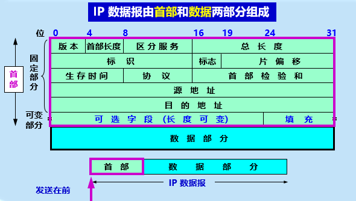

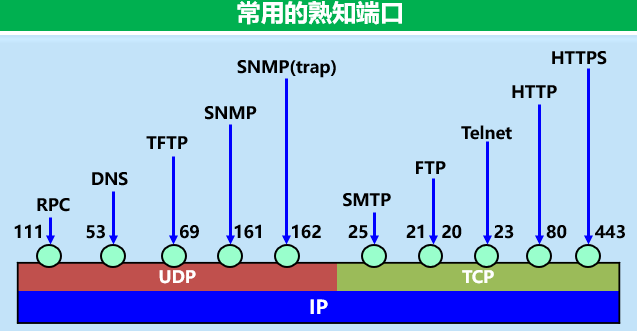

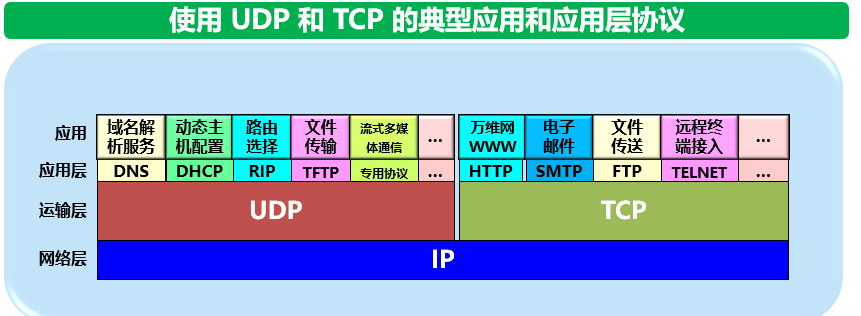

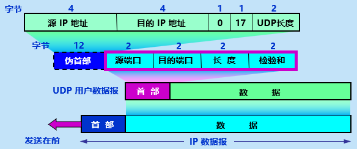

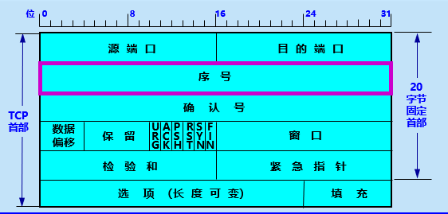

# 第一章  概述

- ==RFC==：**Request For** **Comments** **（请求评论）。**

  - 所有的 **RFC** 文档都可从互联网上免费下载，RFC文档按照发表的时间先后顺序编号。
  - **任何人**都可以用电子邮件随时发表对某个文档的意见或建议。
  - **但并非** **所有** **的** **RFC** **文档**都是互联网标准。

- ==C/S，P2P==

  - 互联网可以划分为两部分：**边缘部分**和**核心部分**
  - 核心部分：提供连通性，核心功能为**路由**和**转发**。
    - 最重要的是路由器：转发收到的分组，**分组交换的关键构件**。
  - 边缘部分的主机被统称为**端系统**。
  - 边缘部分的端系统的两种通信方式，客户/服务器方式：C/S、对等方式:P2P
    - 通信的含义实际上是主机a的某个进程和主机b上的另一个**进程**进行通信。
  - C/S：进程之间服务和被服务的关系。客户是服务请求方，服务器是服务提供方。
    - 客户程序在被用户调用后才进行执行，主动向远地服务器请求服务。
    - 服务器程序一直不停地运行，被动地等待和接收客户的通信请求。
  - P2P：每个主机既是客户又是服务器，不区分服务请求方和提供方，进行平等的对等的连接通信。

- 电路交换，分组交换（优缺点），报文交换

  - 电路交换：这种必须经过“建立连接（占用通信资源）、通话（一直占用通信资源）、释放连接（归还通信资源）”三个步骤的交换方式叫电路交换。

    - 通信双方之间要有一条物理占用的通信通道，通过交换机的交换功能进行互相连接。
    - 交换的含义：电话线的转接，也就是按某种方式**动态**分配传输线路的资源。
    - 主要特点：面向连接的方式、资源预留、通信双方独占资源不可共享、传输性能好但是效率低

  - 报文交换：采用存储转发技术，接收到完整的整个数据报文才开始向下一跳发送。

  - 分组交换：同样采用**存储转发**技术，在发送端将较长的报文划分为更小的等长段，每段数据段前面加上首部构成了分组。

    - 分组又称为“包”，而分组的首部也可称为“包头”。

    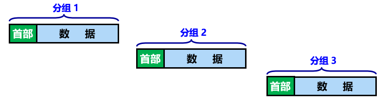

    - 互联网采用**分组交换技术**，分组是互联网中传送的数据单元。发送端依次把各分组发到接收端。接收端收到分组后剥去首部，还原成原来的报文。

    - **根据首部**中包含的目的地址、源地址等重要控制信息进行转发。

      每一个分组在互联网中==独立选择==传输路径。

      位于网络核心部分的**路由器负责转发分组**，即进行分组交换。

      路由器要创建和动态维护==转发表==

    - 优点：高效（动态分配）、灵活（独立）、迅速（不先建立连接就能发）、可靠（可靠协议和网络形式）

    - 缺点：排队延迟（分组转发在各路由器内排队）、不保证带宽（动态分配）、增加开销（分组必须携带控制信息，路由器必须维护转发表）

  - 三种交换的主要区别：电路交换是整个报文，比特流直达终点。报文和分组交换都是存储转发，更灵活可处理突发数据。但报文交换是转发整个报文，分组交换是转发每个分组，时延更小灵活性更好。

- 网络概念及分类（WAN，MAN，LAN，PAN）

  - 计算机网络定义：**由一些自治的系统互连而成的集合，自治系统间按照约定的规则（协议）进行通信，以实现某一特定目的（资源共享或数据通信）。**
  - 分类：
    - 按作用范围：**广域网** **WAN** 、**城域网** **MAN** 、**局域网** **LAN** 、**个人区域网** **PAN**
    - 还有按使用者分为的公用网、专用网；以及用来接入互联网的 **接入网 AN** 

- 性能指标（速率，带宽，吞吐量，时延（发送时延，传播时延），带宽时延积，RTT，利用率）

  - 速度：最重要的一个性能指标。单位：bit/s，或 kbit/s、Mbit/s、 Gbit/s 等。
    - 指的是数据的传送速率，也称为数据率 (data rate) 或比特率 (bit rate)。
  - 带宽：单位时间内某信道的最高数据率，单位 bit/s
  - 吞吐量：单位时间内通过某个网络（或信道、接口）的实际数据量。
  - 时延：从网络（或链路）的一端传送到另一端所需的时间。
    - 总时延  = 发送时延 + 传播时延 + 处理时延 （收到分组的处理）+ 排队时延
    - 发送时延：
    - 传播时延：
    - 二者区别：发送时延与传输信道的长度没有任何关系。传播时延则与信号的发送速率无关。信号传送的距离越远，传播时延就越大。

- ISO OSI/RM：ISO (国际标准化组织) 提出的 OSI/RM (Open Systems Interconnection Reference Model) 是使各种计算机在世界范围内互连成网的标准框架。

- TCP/IP/RM（会话层、表示层、应用层）

- 协议（三要素），服务

  - 协议是为进行网络中的**数据交换**而建立的**规则、标准或约定**。
  - 三要素：语法（数据和控制信息的格式）、语义（需要哪种控制信息，哪种动作和哪种响应）、时序（事件的实现顺序）
  - PDU：协议数据单元，即对等层次之间传送的数据单位，对等层之间的通信。
  - 协议和服务的**区别**：
    - 协议的实现保证能够向上一层提供服务。但上层使用服务而看不见协议，即对上面是透明的。而要实现本层的协议还必须依赖下层服务，协议也能控制本层向上层提供服务。
    - 服务是垂直的，协议是水平的。

  ## 第二章  物理层

- 四个特性（机械，电气，功能，过程）

  - 机械特性（语法）：指明接口所用接线器 形状和尺寸 引线数目和排列 固定和锁定装置等。
  - 电气特性（语义）：指明在接口电缆的各条线上出现的电压的范围。
  - 功能特性（语义）：指明某条线上出现的某一电平的电压的意义。
  - 过程特性（时序）：指明对于不同功能的各种可能事件的出现顺序

- 码元

  - 模拟信号：连续；数字信号：离散。
  - 用时域波形表示数字信号的时候，基本波形就是码元。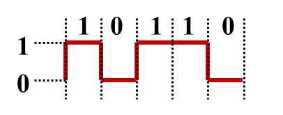
  - 码元速率：波特率：B=1/T（Band）；T为码元的时间宽度
  - 数据传输速率：  S = 1/T *log2 N  ( bps )；N为码元状态数

- 编码（不归零，归零，曼彻斯特，差分曼彻斯特）

  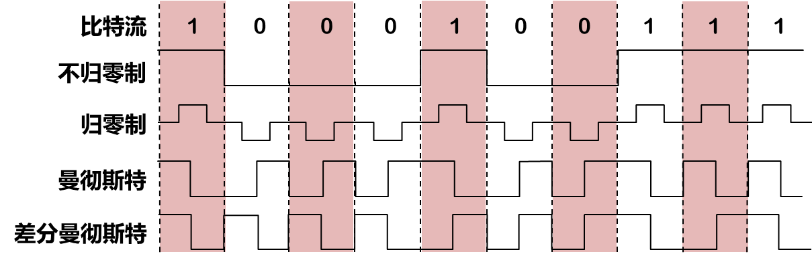

  - 说明：
    - 不归零制的正电平代表1，负电平代表0；
    - 归零制的正脉冲为1，负脉冲为0；
    - 曼彻斯特的位周期中心向上跳为0，向下跳为1；
    - 差分曼的每一位中心必定跳变，位开始边界有跳变就是0，没有跳变代表1。
  - 曼和差分曼的信号频率比不归零制要高。
  - 不归零制不能从信号波形本身提取时钟频率，即没有自同步能力，而曼和差分曼都有。

- 调制（调幅，调频，调相）（振幅、频率、初始相位）

  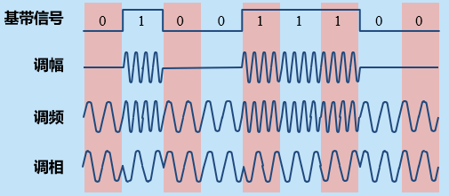

- 奈奎斯特定理（奈氏准则），==香农公式==（p47）

  - ==奈氏准则==：码元传输的最高速率 = 2W （码元/秒）
    - 在带宽为 W (Hz) 的低通信道中，若不考虑噪声影响，则码元传输的最高速率是 2W (码元/秒)。传输速率超过此上限，就会出现严重的码间串扰的问题，使接收端对码元的判决（即识别）成为不可能。
  - ==信噪比==：信噪比(dB) = 10 log10(S/N ) (dB) 
  - ==香农公式==：信道的极限信息传输速率 C  可表达为：
    - C = W log2(1+S/N)  (bit/s) 
    - W 信道的带宽 (Hz)；S  为信道内所传信号平均功率；N 为信道内部的高斯噪声功率。
    -  信噪比越大 极限传输速率越高  只要低于极限传输速率就一定能找到无差错传输办法。

- 传输介质（引导型（双绞线，同轴电缆，光纤），非引导型（无线电微波，卫星））

  - 双绞线：绞合度越高 可用数据传输速率越高。屏蔽层越厚抗干扰效果越好。
  - 同轴电缆：具有很好的抗干扰特性，广泛用于传输高速率的数据
  - 光缆：发送端需要光源，接收端需要光检测器还原出电脉冲，光线在纤芯全反射。
  - 无线电微波：直线传播。多径效应：多条路径信号叠加后失真。微波接力：中继站。
    - 特点：容量大，传输质量高，易于实施；但存在多径效应，大量中继站消耗人力物力。
  - 卫星通信：通信距离远，稳定，但时延大。

- 信道复用技术（频分，时分（统计时分），波分，码分）

  - 频分：带宽分多份，所有用户相同时间占用不同的带宽。频分多址（FDMA）

  - 时分：时间划分为等长的时分复用帧（TDM）每个用户周期性地占用同样的频带宽度。时分多址（TDMA）A代表address，上面的FDM和TDM没有强调是多少用户。

  - 统计时分：（STDM）不是固定分配时隙而是按需动态分配。

  - 波分：（WDM）光的频分，一根光纤同时传输多个光载波信号。

  - 码分复用：同样的时间同样的频带，多个用户时为==CDMA==码分多址。

    - 码片：每个比特时间划分为m个短间隔，实现了扩频，占用宽度扩大到了m倍。
    
      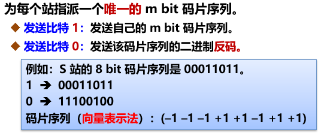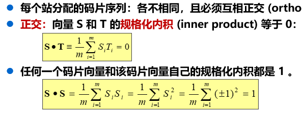
    
    也就是说，总信号和各自的码片求内积，求出来：
    
    •结果为+1，说明这个站发送比特1
    •结果为-1，说明这个站发送比特0
    •结果为0，说明这个站没有发送信息

- 同步光纤网SONET，同步数字系列SDH

  -  早期数字传输系统的缺点：速率标74、15
  -  2】0396准不统一，不是同步传输。
  -  美国率先提出同步光纤网SONET，定义了同步传输的线路速率等级结构
  -  之后定义出SDH：国际标准同步数字系列，传输网络，二者差别甚微
  -  意义就是定义了统一标准和物理层的帧结构，对电信网发展有重大意义。

- ADSL，光纤同轴混合网（HFC网），FTTx 技术

  -  非对称数字用户线ADSL：把 0~4 kHz 低端频谱留给传统电话使用，而把原来没有被利用的高端频谱留给用户上网使用。
     -  非对称：下行（从 ISP 到用户）带宽远大于上行（从用户到 ISP）带宽
  -  HFC (Hybrid Fiber Coax) 网基于有线电视网，把原有线电视网中的同轴电缆主干部分改换为光纤。
     -  HFC 网具有双向传输功能，扩展了传输频带
  -  FTTx 技术：FTTx 表示 Fiber To The…（光纤到…），如光纤到办公室 FTTO (Fiber To The Office)

  ## 第三章  数据链路层

- 链路：从一个节点到相邻节点的一段物理线路，中间没有任何其他的交换结点

  -  数据链路：把实现控制数据传输的协议的硬件和软件加到链路上，就构成了数据链路
     -  典型应用：网络适配器（网卡）

- 三个基本问题：

  -  封装成帧：在一段数据的前后分别加上首部和尾部就构成了一个帧。
     -  帧定界：通过首部和尾部区分出一帧的开始和结束。
     -  帧定界符：控制字符SOH在前，EOT在帧的末尾
     -  成帧的方式：字节计数法、字节填充、比特填充
  -  透明传输：无论发送什么样的比特组合的数据，这些数据都能够按照原样没有差错地通过这个数据链路层。
     -  ==字节填充/字符填充==：数据中出现的SOH和EOT均要加入一个ESC，ESC出现了也加ESC
     -  位填充：有效载荷中出现连续5个1比特，则直接插入1个0比特
  -  差错控制：传输错误的比特占所传输比特总数的比率称为误码率 BER 
     -  检错码：奇偶校验、检验和、循环冗余校验（CRC）

- CRC：==P77==

  -  生成的冗余码就叫FCS，FCS可以通过CRC得出，但并不是唯一途径
  -  注意的除数可以用生成多项式表示，以及除数和余数的位数关系。

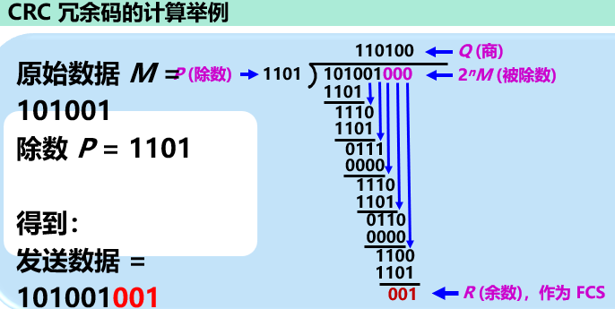

- PPP：对于点对点的链路，目前使用得最广泛的数据链路层协议是点对点协议 （P80）

  - 应满足的需求：

    -  简单（首要的要求），封装成帧，透明，多种网络层协议，多种类型链路，差错检测，检查连接状态，最大传送单元，网络层地址协商，数据压缩协商。

  - 组成：

    -  一个将IP数据报封装到串行链路的方法
    -  一个链路控制协议（LCP）
    -  一套网络控制协议（NCP）

    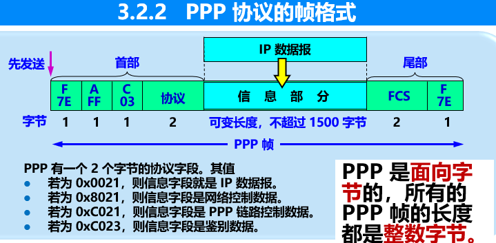

  - 帧格式如上，首部第一个和尾部第二个都是标志位F（flag），规定为0X7E，就是定界符。首部的第二个和第三个是规定的0XFF, 0X03，不携带特殊信息。尾部FCS是CRC检验序列。

  - 第四个是协议字节，如果是0X0021即IP数据报，0XC021即LCP协议数据，0X8021即网络层的控制数据。

  - 透明传输问题：异步传输采用==字节填充==（p81），同步传输采用零比特填充（5个1添0）。

- 零比特插入（见上）

- ==CSMA/CD==，争用期，最小帧长，退避算法（p89）

  -  CSMA 载波监听多路访问协议。特点：先听后发。要点：
     -  多点接入：总线型网络。
     -  载波监听：边发送边监听。
     -  碰撞检测：出现冲突。
  -  征用期：以太网的端到端往返时延 2τ 称为争用期，或**碰撞窗口**。
  -  **最短帧长**计算公式：帧长/网络速率>= 2τ
  -  对于 10 Mbit/s 以太网，**争用期的长度 = 51.2 μs**，在争用期内可发送 512 bit，即 64 字节。10 M以太网规定了**最短有效帧长为 64 字节**。凡长度小于 64 字节的帧都是由于冲突而异常中止的无效帧，应当立即将其丢弃。10 M以太网最大端到端单程时延必须小于争用期的一半 (即 25.6 μs)，相当于以太网的**最大**端到端长度约为 **5 km**。
  -  **退避算法**：截断二进制指数退避：（动态退避）
     -  基本退避时间：2τ，然后从整数集合 [0, 1, … , (2k - 1)] 中随机地取出一个数，记为 r
     -  重传的时延=r * 基本退避时间
     -  k = Min[重传次数, 10]，可见重传次数达到10时 K就不会再增大。重传16次不成功就丢弃，并向高层报告。

- MAC 地址：又叫物理地址或硬件地址。每一台计算机中固化在适配器的 ROM 中的地址。

  -  机构分配前三个字节（高24位），是组织唯一标识符OUI，厂家自行指派后三个，称为扩展标识符，必须要保证生产的适配器没有重复地址。
  -  适配器具有过滤功能，留下三种：单播帧，广播帧和多播帧

- ==MAC 帧格式==（p98）

  

  -  类型字段标志上一层使用的协议，以便把数据交给这个协议
  -  数据字段最小长度=最小长度 64 字节 - 18 字节的首部和尾部 = （46字节）
  -  当数据字段小于46字节就必须加入整数字节的填充字段，保证帧长不小于64字节。 
  -  帧前的8字节，前7字节能迅速实现MAC帧比特同步，第二个字段，1字节是帧开始定界符。
  -  参数 a = 以太网单程端到端时延 τ 与帧的发送时间 T0 之比：a=τ/T0； 信道利用率的最大值 Smax为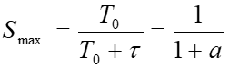。当a远小于1才能让利用率尽可能高。（p94）

- 物理层扩展以太网:集线器 

  -  多个集线器形成更大的以太网，碰撞域更大：扩大了通信区域，但是吞吐量未提高。

- 数据链路层扩展以太网:交换机， 自学习， STP

  -  交换机：实际是多接口网桥，具有并行性。
     -  接口有存储器，并使用专用交换结构芯片。
     -  即插即用，内部有通过自学习算法维护的==交换表==。
     -  优点：每个用户独享带宽，增加了总容量。
     -  交换方式：存储转发||直通
  -  生成树协议（STP）：解决回路问题。不改变物理拓扑，只是逻辑上切断

- 802.1Q ：VLAN（P104）

  -  虚拟局域网VLAN：虚拟局域网 VLAN 是由一些局域网网段构成的与物理位置无关的逻辑组，而这些网段具有某些共同的需求。
     -  优点：改善性能，简化管理，降低成本，改善安全性
     -  划分方法：基于交换机端口，基于MAC地址，基于协议，基于IP子网，基于高层服务

- FE GE 10GE

  -  FE快速以太网（100BASE-T 以太网）：可以全双工（则不用CSMA/CD协议）
  -  GE吉比特以太网：允许在 1 Gbit/s 下以全双工和半双工 2 种方式工作
  -  10GE：只工作在全双工（不用CSMA），万兆比特，帧格式不变，只用光纤作传播媒体。

  ## 第四章  网络层

- 虚电路，数据报

  -  **虚电路**只是一条逻辑上的连接，分组都沿着这条逻辑连接按照存储转发方式传送，并不是真正建立了一条物理连接。
  -  网络层要设计得尽量简单，向其上层只提供简单灵活的、无连接的、尽最大努力交付的**数据报**服务。

  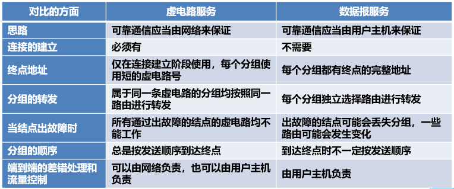

- 控制面，数据面（路由，转发）：网络层的两个层面

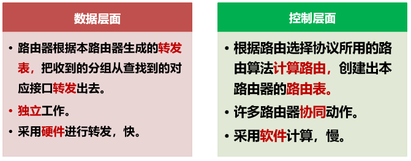

- 互联设备（集线器（转发器），交换机（网桥），路由器，网关）

- ==IP地址（分类，CIDR）==（p124）

  -  表示：点分十进制 **IP地址** **::= { <网络号>, <主机号>} **
  -  分类

  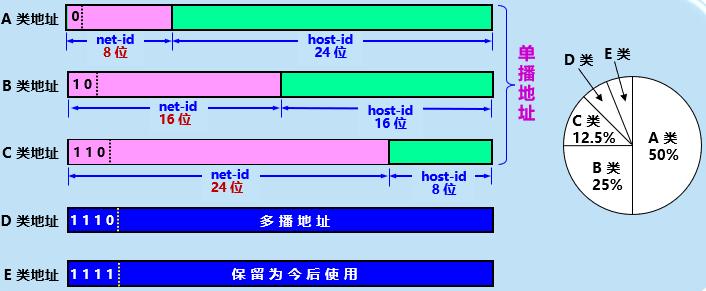

  - 指派主机号要避免全0和全1

  - 地址掩码：子网掩码，里面 1 的个数就是网络前缀(CIDR)或网络号+子网号的长度。

  - CIDR：无分类域间路由选择。斜线记法

  - ip地址的特点：

    -  每个 IP 地址都由网络前缀和主机号两部分组成。
    -  IP 地址是标志一台主机（或路由器）和一条链路的接口。
    -  转发器或交换机连接起来的若干个局域网仍为一个网络。
    -  在 IP 地址中，所有分配到网络前缀的网络都是平等的。

    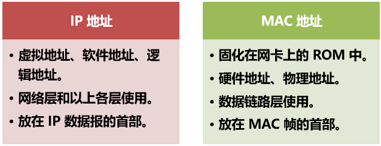

- ==ARP==地址解析协议：（p133）

  -  高速缓存里面存放IP 地址到 MAC 地址的映射表，并且动态更新

- ==IP数据报==格式：（p137）

  

  -  首部的前一部分为固定长度，20字节。

- ==转发分组过程==：（P140）

  -  基于终点的转发：基于分组首部中的目的地址传送和转发
     -  分组在互联网中逐跳转发
  -  最长前缀匹配：使用CIDR时查找表可能不止一个匹配，这时候选择==前缀最长==的匹配。
     -  路由聚合，构造超网
     -  最长前缀的匹配更加具体，地址块越小，路由越具体。
  -  为了避免在查找时浪费过多的时间，可以使用二叉线索树查找转发表

- ==ICMP==：网际控制报文协议（IP层的协议）允许主机或路由器报告差错情况和提供有关异常情况的报告。（p146）

  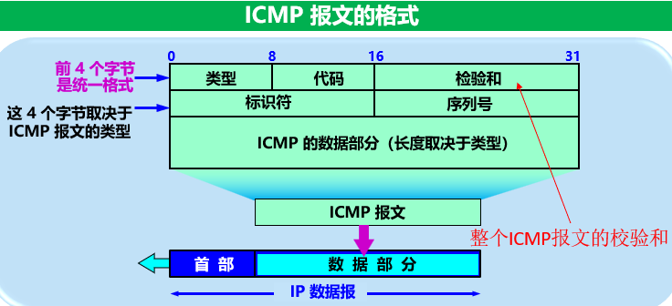

  - ICMP种类：差错报告报文 和 询问报文。

    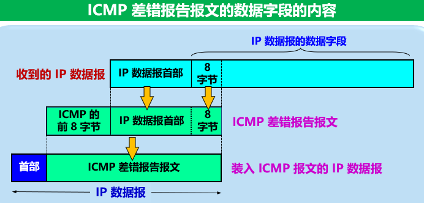

  - 不发ICMP差错报文的情况：

    -  对于ICMP差错报文本身不再发送ICMP差错报告报文
    -  对于第一个分片数据报的后续片都不发送
    -  多播地址的数据报都不发送，特殊地址的都不发送

  - ICMP询问报文：

    -  回送请求和回答：测试目的站是否可达以及状态
    -  时间戳请求和回答：用于时钟同步和时间测量

  - ICMP应用：PING检查

- ==IPv6==（p150）

  -  应对IPV4地址耗尽的问题，仍支持无连接传送，将协议数据单元 PDU 称为分组。
  -  数据报的一般形式：由基本首部和有效载荷两大部分组成。

  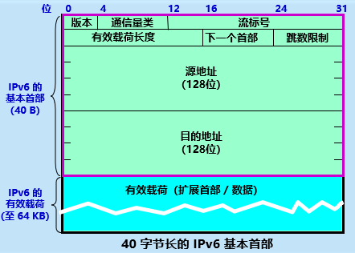

  -  三种基本地址类型：单播、多播、任播（ipv6新增）
  -  地址记法：冒号十六进制记法，每个地址占128位
     -  两个技术：零压缩、点分十进制记法的后缀
     -  零压缩：一串连续的0用一对冒号替代，任一地址中都只能使用一次零压缩。
     -  点分十进制的后缀：冒号十六进制的每一截代表16位，而点分每一截代表8位，最后拼接上后缀就是替代了IPV6地址的最后两个小段
  -  IPV4->IPV6的演进：逐步演进，向后兼容，两种策略：双协议栈和隧道技术

- ==路由协议==：RIP OSPF BGP  （属于网络层控制层面的内容）（p159）

  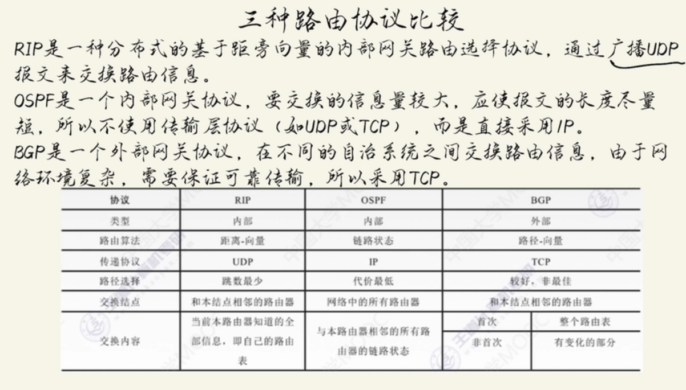

  - 路由算法分类
    - 静态路由选择：非自适应，不能及时适应网络状态变化，简单开销小

    - 动态路由选择：自适应，能较好地适应网络变化，复杂开销大

    - 把互联网划分为小的**自治系统（AS）**，则分为域间路由选择和域内路由选择
      - 内部网关协议IGP（如RIP  OSPF）和外部网关协议EGP（BGP-4）

  - RIP：分布式的、基于距离向量的路由选择协议。
    - 最大的优点：简单。

    - 要求每个路由器都维护从自己到其他网络的距离记录

    - 距离：也叫跳数，经过一个路由器，跳数+1。距离指的是最短距离，只使用最短  不能同时使用多条路由。一条路径最多15个路由器，16个时证明不可达。

    - RIP特点：只和相邻路由器交换信息，交换的信息是本路由器知道的全部信息（自己的路由表），按固定时间间隔交换信息。

    - 路由表：==建立过程==（p160）、==距离向量算法==

    - RIP2报文：由首部和路由部分构成（p162）

    - 好消息传播快，坏消息传播慢（慢收敛），网络故障的时候需要较长时间才能传送。
  - OSPF：开放最短路径优先，是内部网关协议，基于链路状态
    - 重要优点：OSPF更新过程中收敛速度快
    - 三个特点：
      - 洪泛法（向本自治系统所有路由器发）
      - 发送的信息是和本路由器相邻的所有路由器的链路状态（相邻路由器和链路度量）
      - 链路状态发生变化或每隔一段时间，才用洪泛法发信息
    - OSPF对自治系统进行划分为了 区域，上层的主干区域和下层的其他区域。
      - 区域边界路由器ABR、主干路由器BR、自治系统边界路由器ASBR
      - 优点：减少通信量，能应用于大规模网络，缺点是信息种类增加了，协议更复杂
    - 工作过程：（P167）
      - 确定邻站可达
      - 同步链路状态数据库
      - 更新链路状态
  - BGP外部网关协议：是不同自治系统的路由器之间交换路由信息的协议
    - 特点：用于自治系统之间、不算最佳路由只是找比较好的路由，采用路径向量
      - AS之间：半永久性TCP连接，eBGP连接
      - AS内部：也是TCP连接，AS内部所有路由器之间都是全连通的，iBGP连接
        - 内部也有IGP协议，即内部网关协议，包括OSPF RIP
      - 在AS-PATH中不允许出现相同的AS号（相同的会被检测并删除）
    - ==BGP的路由选择==（p173）：本地偏好值最高的、AS跳数最小的、热土豆算法
      - BGP报文也是作为TCP报文的数据部分来传输的

- 路由器

  - 主要工作：转发分组，工作在网络层

  - 整个划分两大部分：路由选择部分（控制层面）和分组转发部分（数据层面）
    - 转发仅仅涉及一个路由器，路由选择涉及到很多的路由器，协作产生路由表

    - 分组转发包含三部分：交换结构、输入端口、输出端口
      - 三种交换方法：通过存储器（中断复制），通过总线（共享总线 忙时排队等待），通过纵横交换结构（互连网络，是无阻塞结构）

- IP多播：在互联网上进行多播就叫做 IP 多播，要靠路由器来实现

  - 目的地址采用D类地址，使用IGMP协议，尽最大努力交付，不产生ICMP差错报文

  - 只拿出 01-00-5E-00-00-00 到 01-00-5E-7F-FF-FF （223 个地址）作为以太网多播地址。或者说，在 48 位的多播地址中，前 25 位都固定不变，只有后 23 位可用作多播。

- IGMP 多播路由选择协议

  - 多播需要两种协议：网际组管理协议IGMP（使知成员信息）和多播路由选择协议（路由器协同）

  - IGMP只能让本地局域网的多播路由器知道本局域网是否有主机参与或退出了多播组，不知道多播组的成员个数，也不知道这些成员在哪个网络上。

  - IGMP工作两个阶段：加入多播组、探询组成员变化情况（周期性探询）

  - IGMP避免开销的措施：所有都使用IP多播，只发送一个询问报文，迅速和多个多播路由器中断 一个探询关系，分散响应，抑制机制

- VPN ：利用公用互联网作为本机构各专用网之间的通信载体，这样的专用网又称为虚拟专用网。

  - 专用网：只用于机构内部的通信。虚拟：实际上没有通信专线只是效果上和专用网一样。

  - VPN类型：内联网（同一机构）、外联网（一个机构和某些外部机构）、远程接入VPN

- NAT：网络地址转换

  - 专用网连接到互联网的路由器上安装NAT，将本地转换为全球IP地址
  - 当 NAT 路由器具有 n 个全球 IP 地址时，专用网内最多可以同时有 n 台主机接入到互联网
  - 可以使专用网内较多数量的主机轮流使用 NAT 路由器有限数量的全球 IP 地址

- MPLS：多协议标签交换

  - 多协议：在 MPLS 的上层可以采用多种协议；标签：MPLS 利用面向连接技术，使每个分组携带一个叫做标签 (label) 的小整数。
  - 工作过程：
    - 找出标签交换路径LSP（使用标签分配协议LDP）
    - 打标签（分类）然后转发
    - 标签对换（入标记更换为出标记）
    - 去除标签（离开MPLS域时，出口节点去除掉标记）
  - MPLS不要求下层均为面向连接，采用了封装技术（IP数据报添上MPLS首部再封装成帧）

- SDN：软件定义网络

  - 核心思想把控制层面和数据层面分离，而让控制层面利用软件控制数据层面中的许多设备，一种新的体系结构
  - 四个关键特征：
    - 基于流的转发。流表规定转发规则。
    - 数据层面与控制层面分离。二者不在同一个设备中。可以由不同厂商提供。
    - 网络控制功能位于数据层面交换机之外，用软件实现。
    - 可编程的网络。

  ## 第五章  运输层

- 端口：在运输层使用协议端口号，或通常简称为端口 (port)。把端口设为通信的抽象终点

  - 软件端口：协议间抽象交互端口；硬件端口：不同硬件设备的交互接口。
  - 端口用一个 16 位端口号进行标志，端口号只具有本地意义，只为了标志本计算机应用层中的各进程。

  

  

- ==UDP==、伪首部：

  - 主要特点：无连接、尽最大努力交付、面向报文、没有拥塞控制、首部开销小
  - 一次交付一个完整的报文，发送也是照样发送，所以需要选择合适的大小。

  

  - 首部8个字节，4个字段，在计算检验和时，临时把 12 字节的“伪首部”和 UDP 用户数据报连接在一起。伪首部仅仅是为了==计算检验和==（p218）。

- 传输控制协议 TCP

  - 面向连接的，把连接作为最基本的抽象。在IP基础上添加了可靠性措施，可靠交付
  - 每条TCP连接只能有两个端点，连接的端点：（套接字socket或端口）。
    - 套接字 socket = (IP地址 : 端口号)                   
  - 是点对点的，全双工通信。
  - 面向字节流，不保证数据块大小的一致，但是能够保证字节流收发一致

- 可靠传输的工作原理：停止等待，连续ARQ，滑动窗口

  - 停止等待协议：每发送完一个分组就停止发送，等待对方的确认。在收到确认后再发送下一个分组。
    - 暂存：在发送完一个分组后，发送方必须暂存已发送的分组的副本，以备重发。
    - 编号：对发送的每个分组和确认都进行编号。
    - 超时重传：发送方为发送的每个分组设置一个超时计时器。若超时计时器超时位收到确认，发送方会自动超时重传分组。重传时间应当比数据在分组传输的平均往返时间更长一些，防止不必要的重传。
    - 信道利用率：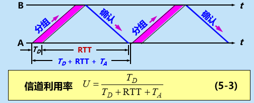
    - 当往返时间 RTT 远大于分组发送时间 TD 时，信道的利用率会非常低。（指超时重传）
    - 简单但是信道利用率太低（考虑流水线传输：收到确认之前，发送方连续发多个分组）
  - 连续ARQ协议
    - 发送窗口：发送方维持一个发送窗口，位于发送窗口内的分组都可被连续发送出去，而不需要等待对方的确认。
    - ==发送窗口滑动==（p230）：发送方每收到一个确认，就把发送窗口向前滑动一个分组的位置。
    - 累积确认：接收方对按序到达的最后一个分组发送确认，表示：到这个分组为止的所有分组都已正确收到了。（易实现但不能反映出正确收到的所有分组）

- ==TCP 报文段的首部格式==（p226）

  - tcp面向字节流但是传输的数据单元是报文段，一个报文段分为首部和数据，首部体现功能

  - 首部最小长度为20字节，后面可以根据需要添加4n字节。

    

  - 记住：若确认号 = N，则表明：到序号 N – 1 为止的所有数据都已正确收到。

  - 最大报文段长度MSS：数据字段的最大长度，即TCP报文段长度--首部长度

    - MSS不能太小（利用率低）、不能太大（开销增大）、尽可能大（不分片即可，默认==536==字节）

- TCP 可靠传输的实现：==滑动窗口==（p231），超时重传时间，

  - 以字节为单位的滑动窗口：

    - 发送窗口：在没有收到确认的情况下，发送方可以连续把窗口内的数据全部发送出去。凡是已经发送过的数据，在未收到确认之前都必须暂时保留，以便在超时重传时使用
    - 接收窗口：只允许接收落入窗口内的数据。

  - 超时重传时间：**最复杂问题之一**：太短引起不必要重传，太长增大空闲时间降低利用率

    - 采用自适应算法：记录报文发出和收到确认的时间，差值就是往返时间RTT
    - 加权平均RTT  也叫平滑RTT：
    - 超时重传时间RTO：略大于RTTs：（）

    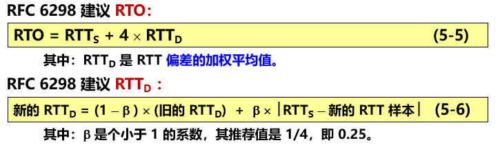

    - Karn算法：重传的报文段的往返时间样本不采用。
      - 缺点：时延突然增大很多时导致RTO无法更新
      - 解决：每重传一次RTO就增大一些，一般是变为旧的2倍。

- TCP 的流量控制：==滑动窗口==（让发送方的发送速率不要太快，使接收方来得及接收）

  - 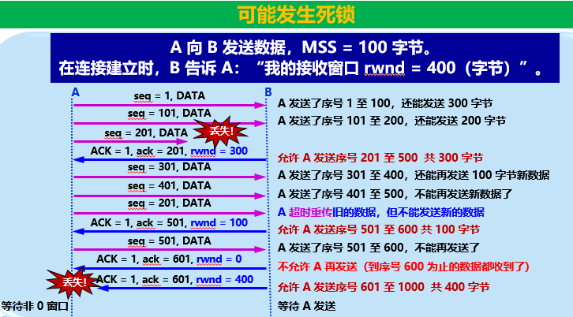
  - 上面图片最下方的互相等待造成了**死锁**（P236），需要使用**持续计时器**解决
    - 只要 TCP 连接的一方收到对方的零窗口通知，就启动该持续计时器。
    - 若持续计时器设置的时间到期，就发送一个零窗口探测报文段（仅携带 1 字节的数据），对方在确认这个探测报文段时给出当前窗口值。
    - 若窗口仍然是零，收到这个报文段的一方就重新设置持续计时器。若窗口不是零，则死锁的僵局就可以打破了。 
  - **糊涂窗口综合征**：接收方缓存满了，但是进程每次只读取一个字节，则让发送方一个字节就发送，而消耗了41字节的ip数据报，效率很低。解决办法：Nagle算法
    - 让接收方等待一段时间，使得或者接收缓存已有足够空间容纳一个最长的报文段，或者等到接收缓存已有一半空闲的空间。只要出现这两种情况之一，接收方就发出确认报文

  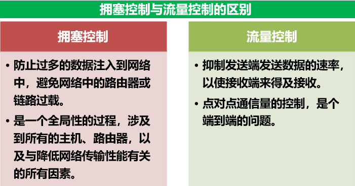

- TCP 的拥塞控制：慢开始 、拥塞避免、快重传、快恢复，RED

  - 拥塞：在某段时间，若对网络中某资源的需求超过了该资源所能提供的可用部分，网络的性能就要明显变坏，整个网络的吞吐量将随输入负荷的增大而下降。
  - 前提：网络能够承受现有的网络负荷。
  - 拥塞窗口cwnd（动态变化）
  - 四种算法：==慢开始、拥塞避免、快重传、快恢复==（p243）
    - 慢开始：开始慢，1字节，但是成倍增长，2、4、8。但有慢开始门限ssthresh。
    - 拥塞避免：缓慢增长
    - 快重传：丢失就立即发送确认，只要一连收到三个就立即重传。
    - 快恢复：一连收到三个重复确认，不执行慢开始，而执行快恢复，门限/2，拥塞窗口也变成相同的门限/2，然后执行拥塞避免缓慢增大。

- TCP 的==运输连接==管理：三次握手  四次放手（p247）

  - 运输连接的三个阶段：连接建立、数据传送、连接释放。（连接采用C/S模式）
  - 解决的三个问题：对方存在，双方协商，资源分配。
    - 建立连接的过程叫做**握手**：三报文握手
    - 释放连接：四报文握手，双方都可以释放连接
      - MSL最长报文段寿命，等待2MSL  A才能关闭（p250）
      - 保活计时器：防止TCP连接出现长时间空闲，达到2h发送10个探测报文，无响应就终止

  ## 第六章  应用层 

- DNS 域名服务系统：

  - 层次树状结构的命名方法：www.myschool.edu
  - 是一个联机分布式数据库系统，采用客户服务器方式
  - 域：名字空间中一个可被管理的划分

  

  - 分为四种类型：根域名服务器、顶级域名服务器、权限域名服务器、本地域名服务器
    - 根域名服务器：最高层次最为重要，知道所有顶级域名服务器的域名和IP地址。是最先被求助的，不直接转换成IP而是告诉下一步应该找哪个顶级域名服务器。
    - 顶级：管理负责的所有二级域名
    - 权限：负责一个区的域名
    - 本地：非常重要，先收到主机的查询请求 
  - 两种查询方式（递归查询很少用，迭代查询经常用）

  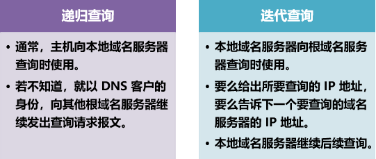

- FTP TFTP：文件传送协议，分别基于TCP和UDP

  - 特点是复制整个文件，然后只对文件副本进行访问和修改传回
  - **FTP基本工作原理**（p270）：
    - 只提供一些基本服务，使用TCP可靠传输，使用客户服务器方式
    - 减少或消除在不同操作系统下处理文件的不兼容性
    - FTP并非对于所有数据传输都是最佳的，当文件很大时复制整个副本就很冗余，不如NFS协议，能够复制大文件中要修改的很小的片段而不是整个大文件。
  - TFTP：简单文件传输协议
    - 很小，易于实现，采用客户服务器方式和UDP数据报
    - 只支持文件传输，不支持交互
    - **TFTP工作过程**：（p271）

- TELNET远程终端协议

  - 允许用户通过TCP连接登录**远地**的一个主机。又称为终端仿真协议。 
  - 能将用户的击键传到远地主机，同时也能将远地主机的输出通过 TCP 连接返回到用户屏幕。
  - 服务是透明的。
  - 可以使用客户-服务器方式：本地运行客户进程，远地运行服务器进程。服务器中的主进程等待新的请求，产生从属进程来处理每一个连接。
  - 网络虚拟终端 NVT 格式 ，1位的控制字符和7位的ASCII字符，发送和接收都需要转换
  - TELNET 的选项协商 (Option Negotiation) 使客户和服务器可商定使用更多的终端功能，协商的双方是平等的。

- WWW URL HTTP HTML

  - 万维网并非计算机网络，而是一个大规模信息储藏所，访问站点的方式叫**链接**

  - 万维网是分布式超媒体系统，是超文本系统的扩充。
    - 超文本：由多个信息源链接成。是万维网的基础。

    - 超媒体与超文本的区别：文档内容不同。超文本文档仅包含文本信息。超媒体文档还包含其他信息，如图形、图像、声音、动画，甚至活动视频图像等。

    - 分布式系统：信息分布在整个互联网上。每台主机上的文档都独立进行管理。

    - 工作方式：客户服务器。客户程序：浏览器。服务器程序：万维网服务器
      - 客户程序向服务器程序发出请求，服务器程序向客户程序送回客户所要的万维网文档。在一个客户程序主窗口上显示出的万维网文档称为页面 (page)。

    - 必须解决的两个问题：
      - 怎么标志互联网文档：**统一资源定位符 URL** （每个文档唯一）

      - 使用什么协议：**超文本传送协议 HTTP** （应用层协议，使用TCP可靠传输）

      - 怎么使得创作的文档能够显示出来并且标记出链接：**超文本标记语言 HTML** 

      - 怎么方便找信息：使用各种的搜索工具（即**搜索引擎**）
  - URL：对网上资源的位置和访问方法的一种**简洁**表示
    - 是**抽象**方法进行**资源定位**，实际上就是网上**资源的地址**。
    - 显然所有资源都有唯一确定的URL，URL相当于他们的指针。
    - 资源：指在互联网上可以被访问的任何对象，包括文档、图像等，与互联网相连的任何形式的数据。
    - 由四个部分组成
      - 协议比如http、ftp。 "://"是规定的格式，必须有。
      - 主机是存放资源的主机在互联网中的域名，也可以是用点分十进制的 IP 地址。
      - ":<端口>"是端口号但经常省略。最后的路径是资源文件目录，较长的字符串。
    - 使用http的URL：http:// 主机名 / 路径（通常把端口省略）
  - ==HTTP==：面向事务的应用层协议。使用TCP连接进行可靠传输。p276
    - 定义了浏览器与万维网服务器通信的格式和规则
    - 是万维网上能够**可靠地交换**文件（包括文本、声音等各种多媒体文件）的重要基础。
    - http操作过程：每个网点都有一个服务器进程不断地监听TCP的端口80以便于发现是否有客户即浏览器发出了建立连接请求。一旦监听到连接建立请求并且建立了TCP连接之后，浏览器就向服务器发送浏览某个页面的请求，服务器就返回请求的页面作为响应，完成任务之后连接就被释放了。
      - 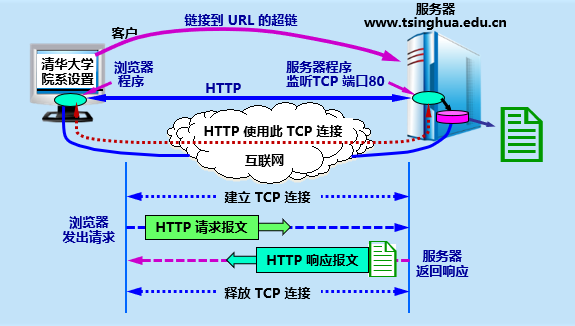
    - HTTP 规定：在 HTTP 客户与 HTTP 服务器之间的每次交互，都由一个 ASCII 码串构成的请求和一个类似的通用互联网扩充，即“类MIME (MIME-like)”的响应组成。
    - 用户浏览页面的两种方法：地址窗口键入URL  /  鼠标点击链接
    - 主要特点：面向连接的TCP、本身是无连接的、也是无状态的（无访问记录）
    - 请求一个文档的时间：所需的时间 >= 
         RTT（三报文握手建立 TCP 连接）+    RTT（请求和接收文档）+文档的传输时间
      = 2 RTT +文档的传输时间
    - 协议：1.0：非持续连接负担很大|:1.1：使用持续连接，分流水线和非流水线工作方式
      - 2.0：可以并发使用同一个TCP连接进行响应，向后兼容，复用连接，二进制编码帧
    - 代理服务器：高速缓存，减少时延
      - 浏览器先和代理连接，发出请求，已经存放就直接放入响应报文返回，没有存放，高速缓存去和源点服务器建立http连接并查找，找到先缓存一份再返回去
    - HTTP的报文结构：
      - 两类：请求报文和响应报文（报文中每个字段的长度不确定）
      - 三部分：开始行（区分请求还是响应）、首部行、实体主体
      - 请求报文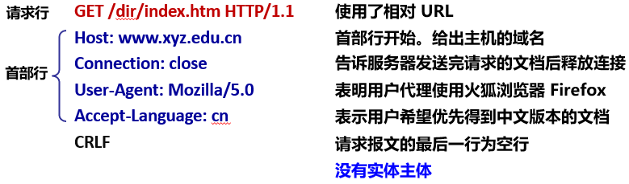
      - 响应报文：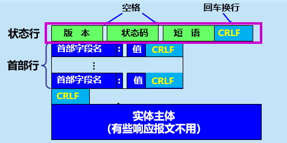
    - cookie：存储跟踪用户信息
  - HTML：制作万维网页面的标准语言，消除不同计算机间信息交流障碍，是万维网重要基础 
    - 万维网文档称为页面，分为静态、动态、活动。
    - HTML 文档是一种可以用任何文本编辑器创建的 ASCII 码文件
    - 定义了许多用于**排版的命令**（即标签）。HTML 文档的**后缀**：.html 或 .htm
    - XML可扩展标记语言，目的是传送数据而不是显示数据，可以自定义且没有限制
    - 静态和动态文档的差别在**服务器端**，静态直接放在服务器，动态访问时才创建。
    - 活动文档能够让浏览器端直接交互，并且控制屏幕的刷新。

- SMTP POP3 IMAP MIME

  - 电子邮件系统三构件：用户代理，邮件服务器，以及邮件发送和读取协议。

  - 简单邮件发送协议 SMTP：用于发送
    - 使用客户服务器方式，基于TCP、基于文本（即ASCII码），采用命令-响应方式

    - 三个阶段：连接建立、邮件传送、连接释放（p296）

  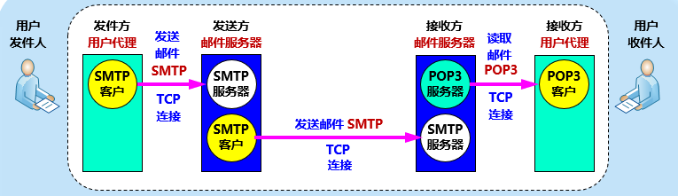

  - 邮局协议 POP3：用于读取、使用TCP，支持用户鉴别，删除已读取文件

  - IMAP：使用客户服务器方式，基于TCP，是一个联机协议

    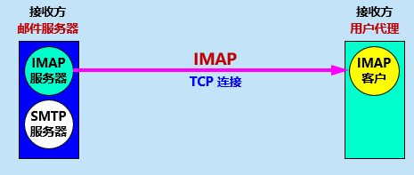

    - 特点：IMAP连接后只下载首部，可以直接在IMAP服务器上面创建和管理文件夹，可以搜索邮件的内容，允许只读取某一个部分，缺点是必须联网。

  - 注意的是邮件读取协议 POP 或 IMAP 与邮件传送协议 SMTP 完全不同。用户代理向源邮件服务器发送邮件，以及源邮件服务器向目的邮件服务器发送邮件，都是使用 SMTP 协议。而 POP 协议或 IMAP 协议则是用户从目的邮件服务器上读取邮件所使用的协议。 

  - MIME：解决SMTP只能传送ASCII编码的二进制问题，增加了邮件结构和新的编码规则

    - 三个部分：5个新的首部、许多内容格式和多媒体表示法、定义了传送编码
    - 可以支持自定义，具体类型（p301）

- DHCP动态主机配置协议：客户服务器方式，基于**UDP**工作

  - 在协议软件中，给协议参数赋值的动作叫做协议配置
  - DHCP采用了即插即用连网的机制，允许一台计算机加入网络自动获取IP而不用手工配置
  - DHCP 给运行服务器软件、且位置固定的计算机指派一个永久地址，给运行客户端软件的计算机分配一个临时地址
  - 需要 IP 地址的主机向 DHCP 服务器广播发送发现报文。DHCP 服务器回答**提供报文**（单播），提供 IP 地址等配置信息。
    - 为了避免DHCP服务器太多，采用**中继代理**，由代理向服务器单播询问。
    - 地址是临时的，有租用期。（p305）

  ## 第九章 无线网络

- 无线局域网 WLAN：采用无线通信技术的局域网。

  - 特点：移动接入、建网速度快、支持便携联网

- 无线局域网的组成

  - 便携站：能移动但是工作时不变。移动站：能移动甚至能够移动通信。
    - 分为有固定基础设施和无固定基础设施（固定基站）
  - IEEE 802.11 的基本服务集 BSS 和扩展服务集 ESS
    - 基本服务集 BSS (Basic Service Set )是无线局域网的最小构件。
    - 一个 BSS 包括一个接入点 AP 和若干个移动站
    - 必须为该 AP 分配一个不超过 32 字节的服务集标识符 SSID和一个通信信道。
    - 一个 BSS 所覆盖的地理范围叫做一个基本服务区 BSA 
    - 每个 AP 有唯一 48 位 MAC 地址，名称是基本服务集标识符 BSSID。每个帧首部都必须有
    - 一个 BSS 可以通过 AP 连接到一个分配系统 DS，然后再连接到另一个 BSS，构成了一个扩展服务集 ESS 
    - ESS 也有个标识符，是不超过 32 字符的字符串名字 (不是地址)，叫做扩展服务集标识符 ESSID。
  - 关联：移动站要加入BSS必须要和某个AP建立关联（和这个 AP 之间创建一个虚拟线路。
    - 关联建立的两种办法：被动扫描和主动扫描（p408）
    - 重建关联服务可以转移到另一个接入点，分离服务可以终止关联。

- 802.11 局域网的物理层

  - 几种实现方法：扩频、多入多出MIMO、正交频分复用等

- 802.11 局域网的 MAC 层协议，CSMA/CA，隐蔽站，预约（RTS，CTS）

  - 必须解决碰撞问题

  - ==CSMA/CA协议==（p414）

    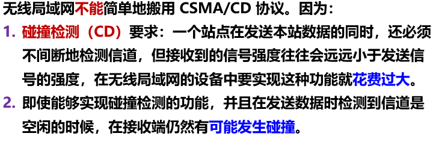

    - 隐藏站问题：由于无线信号覆盖范围和穿透能力有限，A 和 C 检测不到彼此的无线信号，都以为 B 是空闲的，因而都向 B 发送数据，结果发生碰撞。（p413）
    - 解决方法：增加碰撞避免 CA ：尽量减少碰撞发生的概率。使用 CSMA/CA 的同时，使用停止等待协议：链路层确认，解决碰撞后重传。

  - 在完成发送后，必须再等待一段很短的时间才能发送下一帧。这段时间是帧间间隔 IFS 

    - 短帧间间隔SIFS
      - 是最短的时间间隔，分割一次对话中各个帧，站点能够在该时间内切换发送和接收
      - 使用该间隔的：ACK 帧、CTS 帧、由过长的 MAC 帧分片后的数据帧，以及所有回答 AP 探测请求帧和在 PCF 方式中接入点 AP 发送出的任何帧。
    - 分布协调功能帧间间隔 DIFS
      - 比SIFS长得多，空闲时间想发数据必须经过这个间隔，确保上次的ACK确认优先发
      - A 监听信道。若信道在时间间隔 DIFS 一直都是空闲，A 就在 t0 时间发送数据帧 
      - B 收到数据帧后，必须进行 CRC 检验。若检验无差错，再从接收状态转为发送状态。经过时间间隔 SIFS 后，向 A 发送确认帧 ACK。
      - 从 A 发送数据帧 DATA 开始，到收到确认 ACK 为止的这段时间 (DATA + SIFS + ACK) 内，必须不允许任何其他站发送数据，这样才不会发生碰撞。
      - ==争用和退避==（p416）

  - ==信道预约==（p417）：

    - 大大减少碰撞率但会多浪费一些时间[RTS + SIFS + CTS + SIFS]，且也不能完全避免碰撞
    - A 站若收不到 CTS 帧，就不能发送数据帧，而必须重传 RTS 帧。只有正确收到CTS才能发送数据帧。

- 802.11 局域网的 MAC 帧：控制帧、数据帧和管理帧

  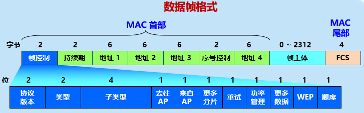

  

  - 数据帧分三大部分：
    - MAC 首部：共 30 字节。复杂
    - 帧主体：数据部分，不超过 2312 字节。802.11 帧的长度通常都小于 1500 字节。
    - 帧检验序列 FCS：尾部，共 4 字节 。
  - 数据帧有四个地址字段，地址1永远是接收地址，地址2永远是发送地址
    - 地址 3 和地址 4 取决于数据帧中的“来自AP”和“去往AP”这两个字段的数值。
    - 注意：上述地址都是 MAC 地址，即硬件地址，而 AP 的 MAC 地址是 BSSID。
  - 序号控制字段、持续期字段和帧控制字段
    - 序号控制：占 16 位，其中序号子字段占 12 位，分片子字段占 4 位。
    - 持续期：占 16 位
    - 帧控制：协议版本、类型和子类型字段（区分功能）、更多分片（为1证明多分片）、WEP（为1证明加密）
  - 