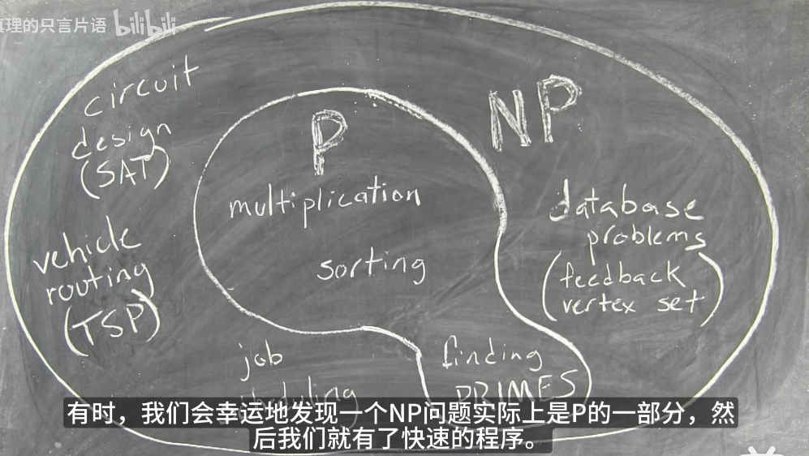
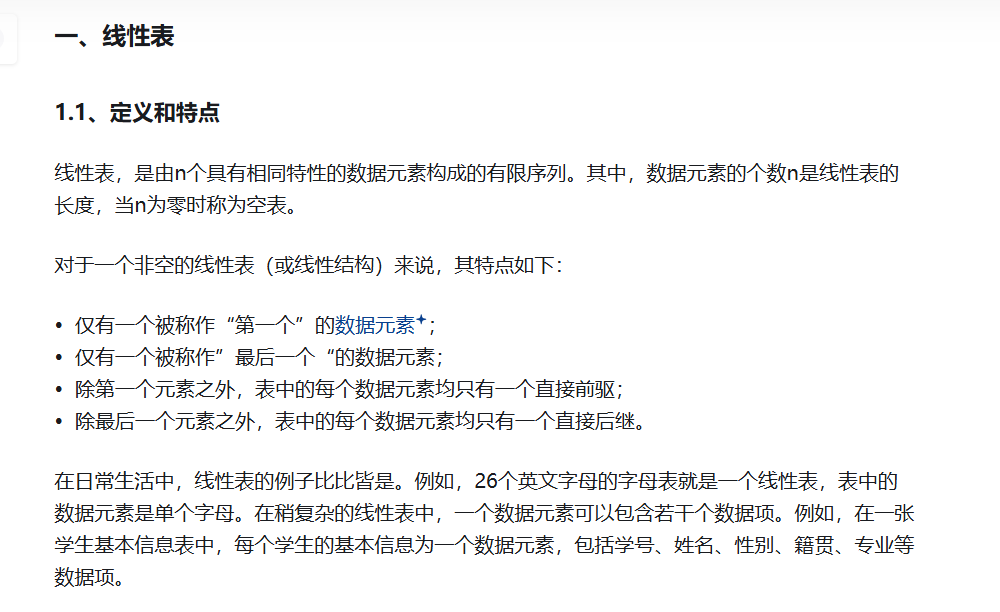
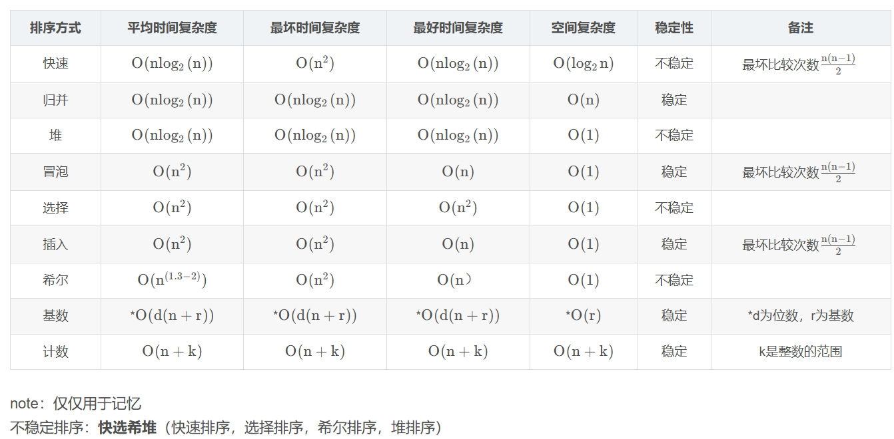

- P和NP问题
  - **P类问题**： 能在多项式时间内可解的问题。 
  - **NP类问题**： 在多项式时间内“可验证”的问题。 也就是说，不能判定这个问题到底有没有解，而是猜出一个解来在多项式时间内证明这个解是否正确。 即该问题的猜测过程是不确定的，而对其某一个解的验证则能够在多项式时间内完成。 P类**问题**属于**NP问题**，但**NP**类问题不一定属于**P**类问题。
  -  **NPC问题**： 存在这样一个**NP问题**，所有的**NP问题**都可以约化成它。 换句话说，只要解决了这个问题，那么所有的**NP问题**都解决了。



- 线性表的特点



- 八大排序算法



- 继承和多态

```C++
class Animal {
public:
	virtual void Walk();//只有虚函数会应用于多态
};
void Animal::walk(){
	cout<<"walk"<<endl;
}
class Dog :  public Animal {  //公有继承最为正式
//多态会继承三类东西：
//1.成员变量 2 .成员函数 3 .类型定义
public:
	void walk() override;//重写标志
}
void Dog::walk(){
 cout<<"dog walk"<<endl;
}
```


- 指针和地址

  ------

  #### 1. `*` 运算符

  `*` 主要有两种用法：

  ##### a. 声明指针

  在声明一个指针变量时使用 `*`，表明这个变量是一个指向某种类型的指针。

  ```C++
  int* p; // p 是一个指向 int 类型的指针  
  ```

  ##### b. 解引用指针

  当你有一个指针并且想访问它所指向的值时，使用 `*` 进行解引用。

  ```c++
  int value = 10;  
  int* p = &value; // p 指向 value 变量的地址  
  std::cout << *p; // 输出 value 的值，即 10  
  *p = 20; // 通过指针修改 value 的值  
  ```

  在这个例子中，`*p` 用于访问 `p` 所指向的值，并可以通过它来修改原始变量的值。

  #### 2. `&` 运算符

  `&` 主要有两种用法：

  ##### a. 取地址运算符

  在表达式中，`&` 用于取得变量的内存地址。

  ```C++
  int value = 10;  
  int* p = &value; // p 存储 value 变量的地址  
  ```

  这里的 `&value` 表示获取 `value` 变量的内存地址，并将该地址赋给指针 `p`。

  ##### b. 引用

  在 C++ 中，`&` 还可以用于声明引用类型。引用是一种对变量的别名。

  ```C++
  int value = 10;  
  int& ref = value; // ref 是 value 的引用，ref 和 value 指向同一个内存位置  
  ref = 20; // 修改 ref 的值同时也修改了 value 的值  
  ```

  在这个例子中，`ref` 是 `value` 的引用，因此对 `ref` 的任何修改都会影响 `value`。

  ##### 3.`*p` 和 `int* p` 不是相同的，尽管它们在程序中都与指针有关。

  ##### a. `int* p`

  - **含义**: `int* p` 是一个指针声明。这意味着 `p` 被声明为一个指向 `int` 类型的指针。这是在定义指针变量时使用的语法。
  - **用途**: 用于告诉编译器 `p` 是一个指针，并且它指向一个整数类型的变量。

  ```C++
  int* p; // 声明 p 是指向 int 的指针  
  ```

  ##### b. `*p`

  - **含义**: `*p` 是一个解引用操作。这是对已经创建的指针 `p` 使用的操作，允许你访问或修改指针所指向的内存地址中的值。
  - **用途**: 用于访问指针 `p` 指向的变量的值。例如，如果 `p` 指向一个整数，`*p` 将返回那个整数的值。

  ```C++
  int value = 10;  
  int* p = &value; // p 指向 value 的地址  
  std::cout << *p; // 输出 value 的值，即 10  
  *p = 20; // 通过指针修改 value 的值  
  ```

  ##### c. `p` 是指针本身，输出的是 `value` 的内存地址，而不是值。

  - **含义**:p是一个整数值（表示内存地址），通常以十六进制格式显示。例如，可能会输出像 `0x7ffee23c9bdc` 这样的地址。

  - **用途**: 如果要将 `int* p = &value;` 这句代码拆成两句，可以首先声明指针变量 `p`，然后再对它进行赋值。如下所示：

    ```c++
    int* p;      // 第一步：声明 p 是一个指向 int 的指针  
    p = &value;  // 第二步：将 value 的地址赋给 p  
    ```

- ------

- 初始化意义

- - **未初始化的局部变量**：在 `main` 函数内部定义的数组 `age` 在未初始化时其值是随机的，这就是导致不正确输出的原因。
  - **全局变量的默认初始化**：全局定义的数组会自动初始化为 0，从而在使用时不会出现意外值。
  
- 邻接表

  ##### 什么是邻接表？

  邻接表是一种用于表示图的常用数据结构。它由一个数组（或向量）构成，数组的每个元素是一个链表（或动态数组），用于存储与该节点相邻的所有节点。这样可以有效地存储稀疏图，因为只存储邻接的边。

  ##### 理解代码中的邻接表

  在你的代码中，邻接表是通过以下结构实现的：

  ```cpp
  vector<int> v[N]; // 声明了一个数组，其中每个元素是一个动态数组（向量）
  ```

  - `v` 是一个大小为 `N` 的数组，`N` 被定义为 100010。这个数组中的每个元素都是一个 `vector<int>` 类型，用于存储与每个节点相连接的节点编号。

  ##### 如何填充邻接表

  在代码中使用邻接表的部分如下：

  ```cpp
  for(int i=1; i<=n; i++){
      int k;
      cin >> k; // 输入当前节点的邻接节点数量
      while(k--){
          int x;
          cin >> x; // 输入与当前节点 i 相连的节点 x
          v[i].push_back(x); // 将 x 添加到邻接表中当前节点 i 的列表
          res[x] = 1; // 标记 x 是由某个节点指向的
      }
  }
  ```

  让我们逐步分析这部分代码：

  1. **循环读取节点**:
     - `for(int i=1; i<=n; i++)`：这段循环遍历从节点 1 到节点 n（假设节点编号从 1 开始）。

  2. **输入邻接节点数量**:
     - `cin >> k;` 表示读取与节点 `i` 相连的节点数量 `k`。

  3. **读取每个邻接节点**:
     - `while(k--)`：这个循环会执行 `k` 次，每次都读取一个与当前节点相连的节点编号 `x`。

  4. **填充邻接表**:
     - `v[i].push_back(x);` 将读取的节点 `x` 添加到邻接列表 `v[i]` 中。这意味着节点 `i` 有一条边指向节点 `x`。

  5. **标记节点**:
     - `res[x] = 1;` 用于维护一个数组 `res`，记录每个节点是否被其他节点指向。`res[x]` 被赋值为 1，表示节点 `x` 至少被某个节点指向。

  #### 示例

  假设有 3 个节点，并且它们的连接关系如下：

  - 节点 1 指向节点 2 和节点 3
  - 节点 2 指向节点 3

  对于上述的链接，输入将是：

  ```
  2
  2 3
  1 3
  0
  ```

  对应的代码执行将是：

  - 节点 1：`k=2`，接下来输入 `2` 和 `3`，因此 `v[1]` 将是 `{2, 3}`。
  - 节点 2：`k=1`，接下来输入 `3`，所以 `v[2]` 将是 `{3}`。
  - 节点 3：`k=0`，没有邻接节点，所以 `v[3]` 将是 `{}`。

  最后，邻接表 `v` 的内容如下：

  - `v[1]`: `{2, 3}`
  - `v[2]`: `{3}`
  - `v[3]`: `{}`

- 构造函数不能被继承

  -  也就是说，构造函数不可以被定义为虚函数

- 只有当对象被创建后 this 才有意义，因此不能在 static 成员函数中使用

  - this 实际上是成员函数的一个形参，在调用成员函数时将对象的地址作为实参传递给 this。不过 this 这个形参是隐式的，它并不出现在代码中，而是在编译阶段由编译器默默地将它添加到参数列表中。

- ##### 正确的初始化方式：

  ```c++
  int a[2][4] = {{1, 2, 3, 4}, {5, 6, 7, 8}};//初始化时能省略行，但不能省略列 
  ```

- 1. 结构和联合都是由多个不同的数据类型成员组成, 但在任何同一时刻, 联合中只存放了一个被选中的成员（所有成员共用一块地址空间）, 而结构的所有成员都存在（不同成员的存放地址不同）。

  2. 对于联合的不同成员赋值, 将会对其它成员重写, 原来成员的值就不存在了, 而对于结构的不同成员赋值是互不影响的。

  3. 联合变量是可以被初始化的，但这个初始化值必须是联合第一个成员的类型，而且它必须位于一对花括号里面。

-  指针变量必须在初始化后才可以正确使用

  - **正确**。未初始化的指针（例如野指针）指向未知的地址，使用它们会导致未定义行为。

- 指针变量可以直接和一个整数做加法或者减法运算

  - **正确**。指针与整数相加或相减是允许的，且指针加法或减法会按照指针指向的类型的大小来进行调整。例如，如果一个指针指向 `int` 类型，指针加 1 实际上是移动到下一个 `int` 变量的位置（即增加 `sizeof(int)` 的字节数）。
  - 指针变量之间不能直接相加。指针相加是没有意义的。可以对指针进行加减操作，但它是基于指针指向的类型的大小进行偏移的。指针加法是增加指向对象的数量，而不是直接将两个指针值加在一起。例如，`ptr1 + ptr2` 是不合法的。

- 翻译程序能够直接执行，也就是被编译后的程序，汇编程序

- 

- 2^n = 计算结果：：

  ```cpp
  #include <cmath>
  long long res= pow (2,n); //pow是一个计算指数的函数
  cout<<"2^"<<n<<" = "<<res<<endl;
  ```

- 冒泡排序

```c++
void bubbleSort(int arr[], int size) {
    for (int i = 0; i < size - 1; i++) {
        for (int j = 0; j < size - i - 1; j++) {
            if (arr[j] > arr[j + 1]) {
                // 交换元素
                int temp = arr[j];
                arr[j] = arr[j + 1];
                arr[j + 1] = temp;
            }
        }
    }
}
int main() {
    int arr[] = {64, 34, 25, 12, 22, 11, 90};
    int size = sizeof(arr) / sizeof(arr[0]);

    cout << "原始数组：";
    for (int i = 0; i < size; i++) {
        cout << arr[i] << " ";
    }
    cout << endl;

    bubbleSort(arr, size);

    cout << "排序后的数组：";
    for (int i = 0; i < size; i++) {
        cout << arr[i] << " ";
    }
    cout << endl;

    return 0;
}
```

- 求阶乘

```c++
int jie(int n){
    
        if(n>1){
           return n*jie(n-1); 
        }
        return 1;
}
```

- 打印图像

​			对于横纵不对称，四舍五入的情况，将n设置为浮点数，则.5变为+1

```c++
for (int i = 0; i < n/2 ;i++){
        for (int j = 0; j < n ;j++)
        {
            cout << c;
        }
        cout << endl;
    }
```

- 两个非确定性整数+字符在一行以空格相隔：

```c++
string s1,s2;
    cin>>s1;
    getchar();
    getline(cin,s2);
s1.length()//确定循环次数
isdigit(s2[i])==0//判断字符串的某一位是否是数字
    if(isdigit(s1[i])==0||stoi(s1)<1||stoi(s1)>1000){//整个字符串
            s1="?";
            break;
        }
```

- SCII码

  a-z：97-122

  A-Z：65-90

  0-9：48-57

- 个位数统计：

```c++
string n;
int arr[10]={0};
getline(cin,n);
for(char c :n){
    if(isdigit(c)){
        array[c-'0']++
    }
}
for(int i=0;i<10;i++){
    if(array[i]!=0){
        cout<<i<<array[i];
    }
}
```

- 座位表统计

  ```c++
  vector<long> id(n);       // 存储考生身份编号
      vector<int> seat1(n);     // 存储考生的实际分数
      vector<int> seat2(n);     // 存储考生的第二门科目成绩
  for(i...){
      cin>>id[i]>>seat1[i]>>seat2[i];
  }
  for(j...){
      if(seat1[j]==query)
          cout<<seat2[j]<<id[j]
  }
  ```

  

- 字母朗读：

```c++
cin>>a;
    if(a<0){
        cout<<"fu ";
        a=-a;//注意负数的转化
    }
    int m=1;
    int t =a;
    while(t>9){
        t/=10;
        m*=10;//m的变化
    }
    do{
        int b=a/m;//从高往低取
        switch(b){
                case 0 :cout<<"ling";break;//注意break语句
                case 1 :cout<<"yi";break;
                case 3 :cout<<"san";break;
                case 8 :cout<<"ba";break;
                case 9 :cout<<"jiu";break;  
        }
        if(m>9)cout<<" ";//空格的逻辑
        a%=m;//迭代变化
        m/=10;//m的缩小
    }while(m>0);
```

- 密码检查

```c++
 cin>>n;
    cin.ignore();//忽略换行符
    for (int i = 0;i<n;i++){//下面的都在这一个for循环里面
        string s;getline(cin,s);
        int flag=0,word=0,num=0;
        if(s.length()<6){//不足六个字母直接输出
            cout<<"Your password is tai duan le."<<endl;
        }else{
            for(char ch :s){//经典遍历字符串
                if ((ch >= 'a' && ch <= 'z') || (ch >= 'A' && ch <= 'Z') || (ch >= '0' && ch <= '9') || ch == '.') {  
                    flag = 0; // 合法字符  
                } else {  
                    cout << "Your password is tai luan le.\n";  
                    flag = 1; // 发现非法字符 ，直接跳出结束 
                    break;  
                }
                //单独判断word和number
          if((ch >= 'a' && ch <= 'z') || (ch >= 'A' && ch <= 'Z'))  word=1;
          if(ch >= '0' && ch <= '9')   num=1;
           
            }
            if(flag==0){
                if(word==1&&num==0){
                    cout<<"Your password needs shu zi."<<endl;
                }
                if(word==0&&num==1)
                if(word==1&&num==1)...
```

- 对于C++取固定位数的小数

```c++
#include<iomanip>//很重要
cout<< fixed << setprecision(1)<<c<<endl;//固定一位小数
printf("%.1f\n", c);
```

- 对于取出一行数的各个位数

```c++
scanf("%1d%1d%1d%1d%1d%1d\n",&a,&b,&c,&d,&e,&f);//能取233008各个位数单独
```

- 大笨钟的心情

```c++
while(cin>>n){//注意循环条件
        if(n<0||n>23)break;//不符合规范就直接退出，不进行处理
        if(arr[n]>50){//大小的匹配
            cout<<arr[n]<<" Yes"<<endl;
        }else{
            cout<<arr[n]<<" No"<<endl;
        }
    }
```

- 出栈入栈的合法性检查

```c++
cin>>n>>max;
for (auto i :n){
    cin>>s;
    for(j;j<s.length();j++)
        if(s[i])=='S'//出入栈的标志
            if(top==max)
                flag=1;//标志是否违法
    		else
                top++;//对容量的维护
    	else
            if(top==0)
                flag=1
            else
                top--;
    if(flag==1||top!=0)
        cout<<no;
    else 
        cout<<yes;  
}
```

- 装箱子问题

```c++
cin>>a[i]
int b[i]={100}//b的初始容量
max=1;//初始用到的箱子个数
for(i<n)
    for(j<=max)
        if(b[j]>=a[i])
            b[j]-=a[i]
            cout<<a[i]<<j
            break
        else
            if(j==max)
                max++;//第一步就++，后面都变为了这个箱子
				b[max]-=a[i]
                cout<<a[i]<<max
        		break;
cout<<max;
```


- 几个函数题的链接（较难）

- https://blog.csdn.net/zhaoxiy/article/details/105779900?fromshare=blogdetail&sharetype=blogdetail&sharerId=105779900&sharerefer=PC&sharesource=zjycxy235678&sharefrom=from_link

- https://blog.csdn.net/weixin_43751983/article/details/90743073?fromshare=blogdetail&sharetype=blogdetail&sharerId=90743073&sharerefer=PC&sharesource=zjycxy235678&sharefrom=from_link

- https://blog.csdn.net/aillear/article/details/124517344?fromshare=blogdetail&sharetype=blogdetail&sharerId=124517344&sharerefer=PC&sharesource=zjycxy235678&sharefrom=from_link

- https://blog.csdn.net/Thirty_Bob/article/details/142499970?fromshare=blogdetail&sharetype=blogdetail&sharerId=142499970&sharerefer=PC&sharesource=zjycxy235678&sharefrom=from_link

  


