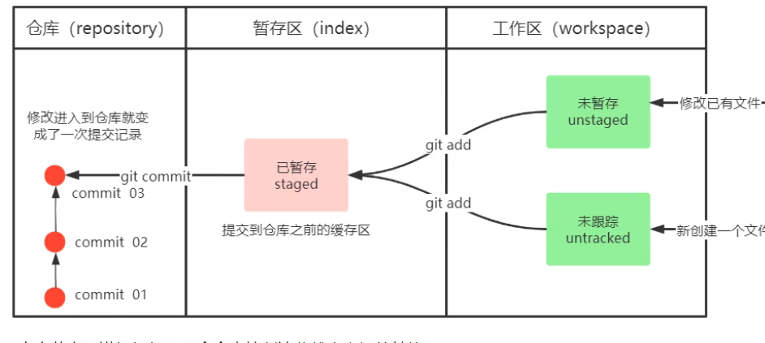
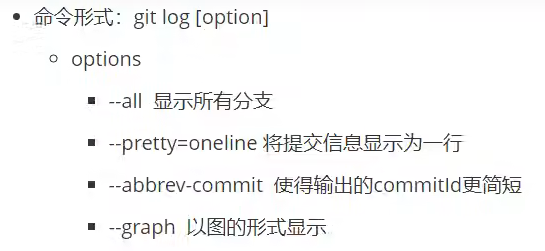
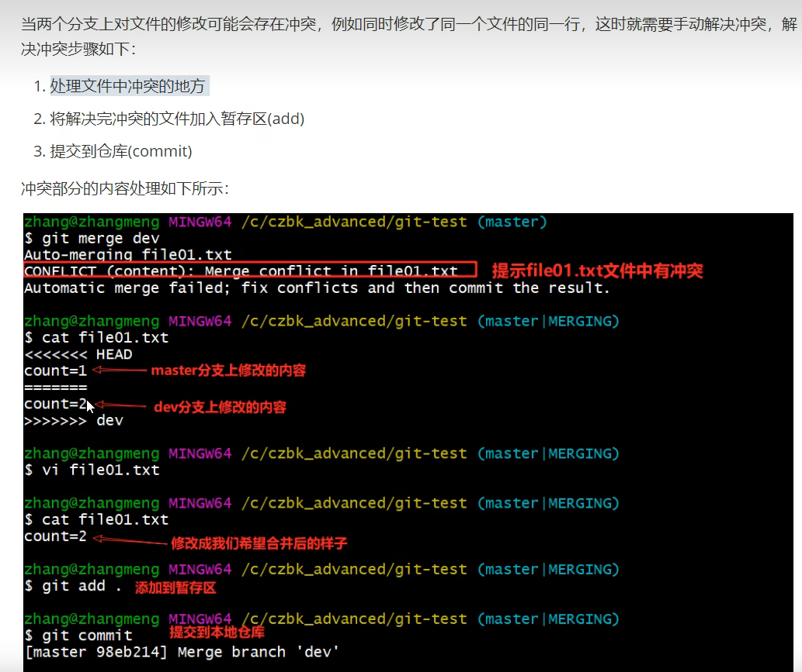
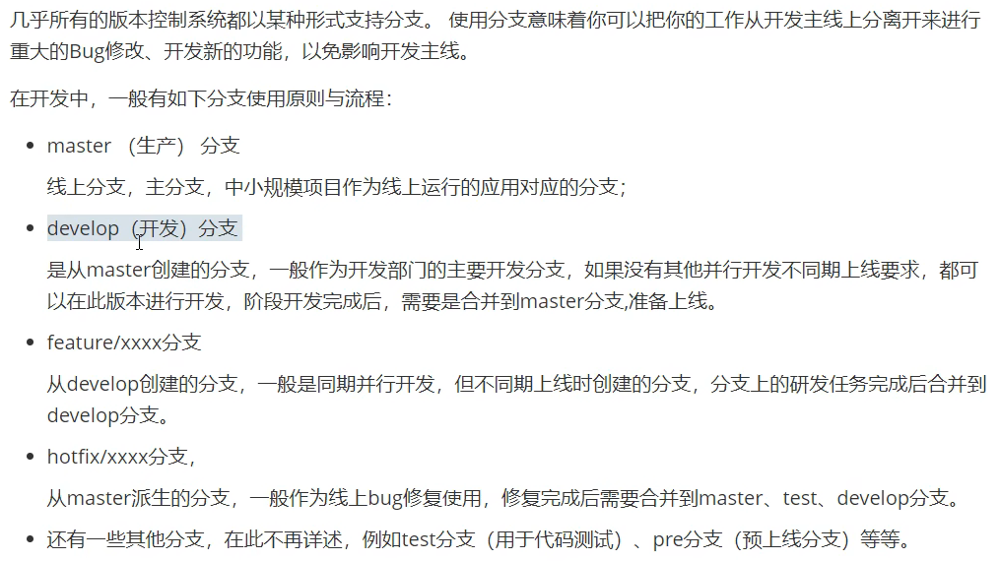

# git常用操作说明

---

- git bash 命令行窗口
- 执行 git init 指令，则当前文件夹变为git仓库（隐藏文件出现.git)
- ll指令/ls指令：查看当前文件夹目录，一般用ll（等价ls -al)
- 创建文件 ==touch== file01.txt  （这样可以命令行直接创建文件）
- 查看文件状态 ==git status==
- clear清除当前命令行的所有信息
- ==git add (工作区-->暂存区)==

​	    ==git commit（暂存区-->本地仓库）==

- ==git add .== 添加所有的文件到暂存区
- ==git add "the use of git"==对于文件夹的操作（必须双引号）
- git commit -m"add one file" （-m后面是修改信息）
- git log 查看提交日志<!--可以设置别名使得长指令变短-->

- git reflog 可以看到已经删除的提交记录
- git reset --hard commitID 版本回退（id可以用log查看）
  - 对于ID问题，命令行不用control+c/v，双击选中即复制，单击鼠标滚轮可以粘贴，或者右键可以粘贴

- touch .gitignore 创建一个忽略文件，可以让某些文件脱离版本控制，不受==git add .==的控制（vi gitignore进入编辑，输入.a后缀可以忽略这类文件，然后按esc退出编辑，然后输入英文 ==:wq==就可以退出返回）
- git branch 查看所有的分支
  - git branch dev01创建一个叫dev01的分支
-  header指向的分支为当前的分支。
  - git checkout dev01切换到dev01这个分支

- git checkout ==-b== dev02创建并切换到分支dev02
- git branch -d dev02 删除dev02分支
- git branch -D dev02 强制删除dev02分支，而不做任何检查
- git merge dev01合并分支（一般到master上面）
- 合并可能遇到冲突

- 分支通常的命名规范

------

#### 连接远程仓库

需要进行远程仓库的创建:star2:

- git remote add origin +地址    （origin为远程仓库的命名）
- git remote 查看目前的远程仓库
- git push origin master:master 
  - 把本地的master推到远端origin仓库的master分支
  - 可以加上--set-upstream，只需加第一次就可以联系起来
  - 后续只需要用 git push （后面的均可省略） 
- 把远程仓库拉取到本地（克隆只用一次）
  - 在需要存的文件夹打开git bash ，输入
  - git clone <仓库路径>[本地目录]  （本地目录可省略）
- 从远程仓库抓取和拉取
  - git fetch [remote name] [branch name]把远端修改移到本地，但是和本地是分离的，需要合并
  - git pull 拉取是自动拉下来并且合并
- 拉到本地解决冲突，提交到本地然后再次提交远程